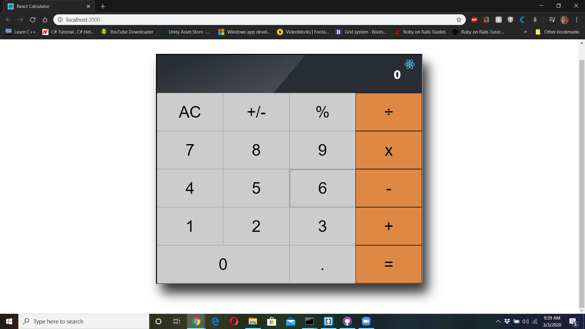

# REACT-Calculator
In this project you will learn how to build a very simple React application. You will work in a real-world project for a fictional company that requires your help. The project has been split into multiple milestones, and each milestone has functional and technical requirements that you will need to implement.  The original version of this content can be found and edited [here](https://github.com/microverseinc/project-react-calculator/blob/master/README.md).



## [Live DEMO Link](https://react-calculator-aaronrn.netlify.com/)

## Built With

- HTML, CSS
- JavaScript
- Node.js
- React.js

## Setup

### Install Dependencies

```
$ npm install
```

### Run Application

```
$ npm run start
```

## Author

👤 **Aaron Rory**

- Github: [@Aaron-RN](https://github.com/Aaron-RN)
- Twitter: [@ARNewbold](https://twitter.com/ARNewbold)
- Linkedin: [Aaron Newbold](https://www.linkedin.com/in/aaron-newbold-1b9233187/)

## 🤝 Contributing

Contributions, issues and feature requests are welcome!

Feel free to check the [issues page](issues/).

## Show your support

Give a ⭐️ if you like this project!

## 📝 License

This project is [MIT](lic.url) licensed.
